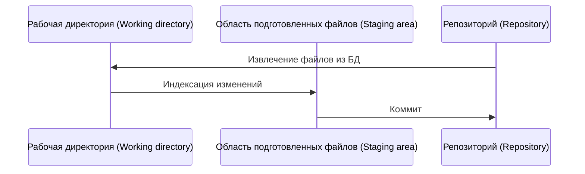

# GIT

## Термины
https://www.w3schools.com/git/git_new_files.asp?remote=github

Система контроля версиями (Version Control System, VCS) - это система контроля версий, которая помогает отслеживать историю изменений в файлах.



Репозиторий (Repository) — это все файлы, находящиеся под контролем версий, вместе с историей их изменения и другой служебной информацией.  

Рабочая директория (Working directory) - является снимком одной версии проекта. Эти файлы извлекаются из сжатой базы данных в каталоге Git и помещаются на диск, для того чтобы их можно было использовать или редактировать.  

Область подготовленных файлов (Staging area) - это обычный файл, обычно хранящийся в каталоге Git, который содержит информацию о том, что должно войти в следующий коммит. 

История (History) - список связанных состояний (коммитов) проекта.

Коммит (Commit) - делает для проекта снимок текущего состояния изменений, добавленных в раздел проиндексированных файлов.  

Ветка (Branch) - это простой перемещаемый указатель на один из коммитов.

## Настройка
[git config](https://git-scm.com/docs/git-config) - используется для получения и установки параметров репозитория или глобальных.  
1. Проверка текущей конфигурации имени пользователя и почты в git. Ввести в консоли команды:
```console
git config user.name
git config user.email
```
2. Настройка имени пользователя и почты глобально (для всех репозиториев). Ввести в консоли команды:
```console
git config --global user.name "{name}"
git config --global user.email "{email}"
```
3. Настройка имени пользователя и почты в конкретном репозитории. После клонирования или инициализации репозитория, перейти в него в консоли и выполнить команды:
```console
git config user.name "{name}"
git config user.email "{email}"
```

## Инициализация репозитория
[git init](https://git-scm.com/docs/git-init) - создаёт в текущем каталоге новый подкаталог с именем `.git`, содержащий все необходимые файлы репозитория - структуру Git репозитория. На этом этапе проект ещё не находится под версионным контролем.
```console
git init
```

## Проверка статуса
[git status](https://git-scm.com/docs/git-status) - используется для отображения состояния репозитория и промежуточной области. позволяет видеть отслеживаемые, неотслеживаемые файлы и изменения. Эта команда не будет отображать какие-либо записи или информацию о фиксации.
```console
git status
```

## Добавление файлов
[git add](https://git-scm.com/docs/git-add) - перемещает файлы в промежуточную область, помечая их для включения в следующий коммит. Можно выбрать все файлы, каталог, определенные файлы или даже определенные части файла для подготовки и фиксации.
```console
git add .
git add {path}
```

## Коммит
[git commit](https://git-scm.com/docs/git-commit) - cоздайте новый коммит, содержащий текущее содержимое индекса и данное сообщение журнала с описанием изменений.
```console
git commit -m "{message}"
```

## Просмотр истории
[git log](https://git-scm.com/docs/git-log) - показывает журналы коммитов.
```console
git log
git log --all --decorate --oneline --graph
```

## Просмотр коммитов
[git show](https://git-scm.com/docs/git-show) - позволяет посмотреть определнный коммит.
```console
git show {commit_hash}
```

## Получение списка, создание и удаление веток
[git branch](https://git-scm.com/docs/git-branch) - позволяет получить список веток, создать или удалть ветку.
```console
git branch
git branch -a -v
git branch {new_branch_name}
git branch -d {existing_branch_name}
```

## Переключение между ветками
[git checkout](https://git-scm.com/docs/git-checkout) - позволяет переключаться между ветвями.
```console
git checkout {existing_branch_name}
git checkout -b {new_branch_name}
```

## Слияние веток
[git merge](https://git-scm.com/docs/git-merge) - объединить две или более ветки в одну.
```console
git merge {existing_branch_name}
```

## Перемещение указателя HEAD
[git reset](https://git-scm.com/docs/git-reset) - позволяет установить текущий указатель HEAD в указанное состояние.
```console
git reset {commit_hash}
```

## Просмотр дерева коммитов
`!!! Создается как алиас !!!`  
[git hist](https://skazkin.su/sozdanie-komandy-git-hist-krasivyj-log-kommitov/)  
```console
git hist
```

## Откат коммитов
[git revert](https://git-scm.com/docs/git-revert) - позволяет отменить некоторые существующие коммиты.
```console
git revert {commit_hash}
```

## Просмотр и добавление репозиториев
[git remote](https://git-scm.com/docs/git-remote) - позволяет управлять набором отслеживаемых репозиториев.
```console
git remote -v
git remote add {short_name} {url}
```

## Извлечение из репозитория (без автоматического слияния изменений)
[git fetch](https://git-scm.com/docs/git-fetch) - позволяет скачать объекты и ссылки из другого репозитория.
```console
git fetch
```

## Извлечение из репозитория (c автоматическим слиянием изменений)
[git pull](https://git-scm.com/docs/git-pull) - позволяет извлечь файлы из репозитория или локальной ветки и соеденить их с текущей.
```console
git pull
```

## Обновление репозитория
[git push](https://git-scm.com/docs/git-push) - позволяет обновить репозиторий.
```console
git push
```
